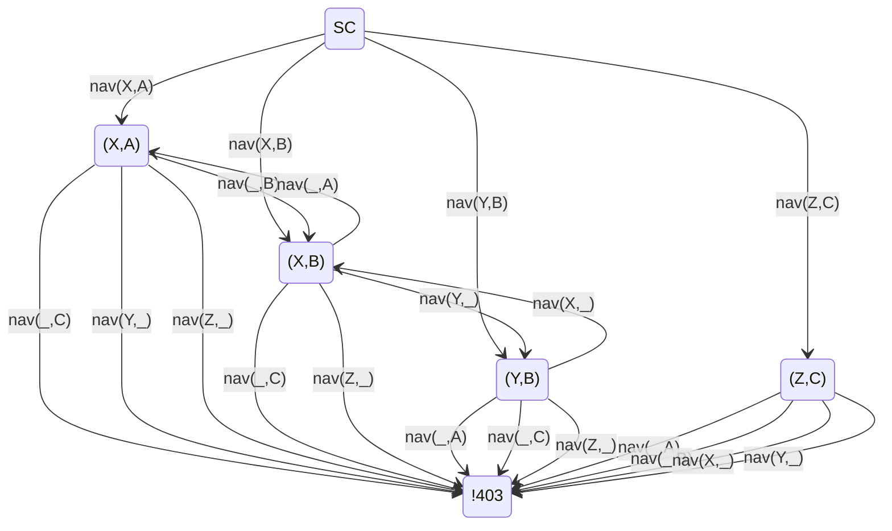

# Langelinie [^bignote] 

Experiments with Mermaid (diagrams and charts in Markdown)


## Basic usage
<pre><code>
stateDiagram-v2
  SC --> (X,A): nav(X,A)
  SC --> (X,B): nav(X,B)
  SC --> (Y,B): nav(Y,B)
  SC --> (Z,C): nav(Z,C)

  (X,A) --> (X,B): nav(_,B)
  (X,A) --> !403: nav(_,C)
  (X,A) --> !403: nav(Y,_)
  (X,A) --> !403: nav(Z,_)

  (X,B) --> (X,A): nav(_,A)
  (X,B) --> !403: nav(_,C)
  (X,B) --> (Y,B): nav(Y,_)
  (X,B) --> !403: nav(Z,_)

  (Y,B) --> !403: nav(_,A)
  (Y,B) --> !403: nav(_,C)
  (Y,B) --> (X,B): nav(X,_)
  (Y,B) --> !403: nav(Z,_)

  (Z,C) --> !403: nav(_,A)
  (Z,C) --> !403: nav(_,B)
  (Z,C) --> !403: nav(X,_)
  (Z,C) --> !403: nav(Y,_)

</code></pre>



## Basic usage
<pre><code>
```mermaid

TYPE 
    command 1
    ....
    command foo

```
</code></pre>

## Tasks

- [x] Inform the mgt.
- [ ] Solving world miracle n°3 
- [x] Solving world miracle n°23 
- [ ] Solving world miracle n°666 
- [ ] Update the website
- [ ] Contact the media
- [x] Set up CI/CD pipeline 

## External resources 

- https://gist.github.com/vtsoup/f1f79d19d6f8e58396bde8847c09a62e 
- https://gist.github.com/ChristopherA/bffddfdf7b1502215e44cec9fb766dfd
- https://gist.github.com/balanza/39bd68f3978ae7dd6a486321b2251ce7 
- https://jojozhuang.github.io/tutorial/mermaid-cheat-sheet/
- https://markdownmonster.west-wind.com/docs/Markdown-Rendering-Extensions/Rendering-Mermaid-Charts.html

^
[^bignote]: 
<i>Langelinie</i> is a pier, promenade and park in central Copenhagen, [home of the the litte mermaid](https://en.wikipedia.org/wiki/The_Little_Mermaid_(statue))

[Coord: 14/55.68155/12.60158](https://www.openstreetmap.org/?mlat=55.692861&mlon=12.599278&zoom=15#map=14/55.68155/12.60158)