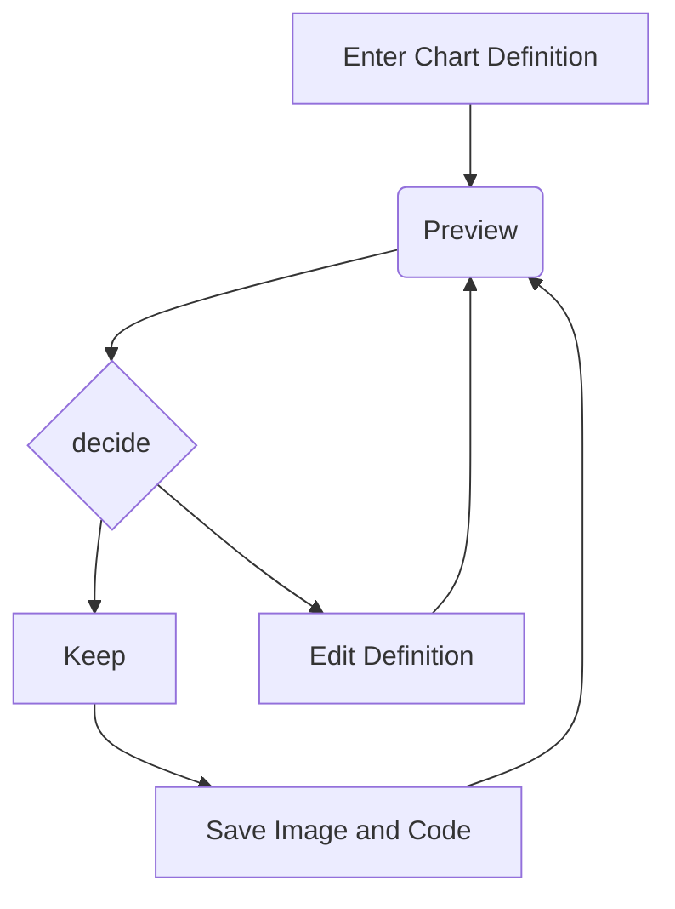
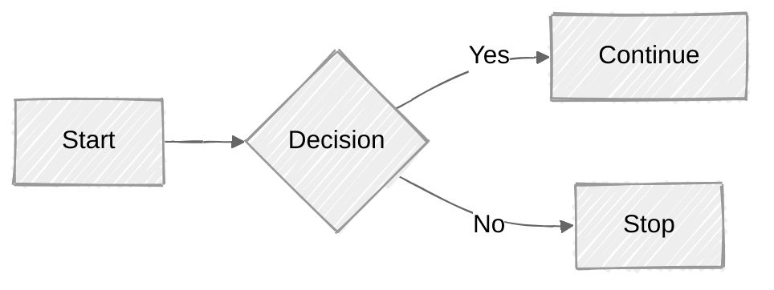
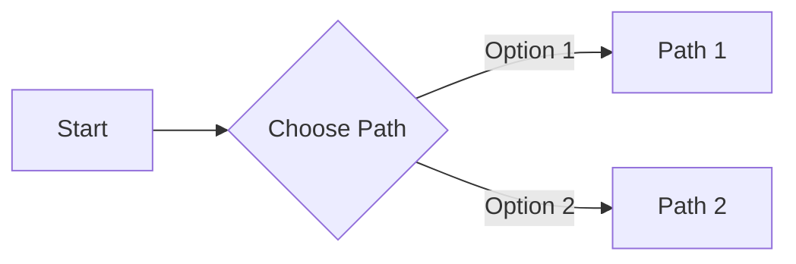

# FOOO

```mermaid
graph TD
    A[Enter Chart Definition] --> B(Preview)
    B --> C{decide}
    C --> D[Keep]
    C --> E[Edit Definition]
    E --> B
    D --> F[Save Image and Code]
    F --> B
```

## Bar

```mermaid
---
config:
  look: handDrawn
  theme: neutral
---
flowchart LR
  A[Start] --> B{Decision}
  B -->|Yes| C[Continue]
  B -->|No| D[Stop]

```

### hahsgja

```mermaid
---
config:
  layout: dagre
  look: classic
  theme: default
---
flowchart LR
A[Start] --> B{Choose Path}
B -->|Option 1| C[Path 1]
B -->|Option 2| D[Path 2]
```