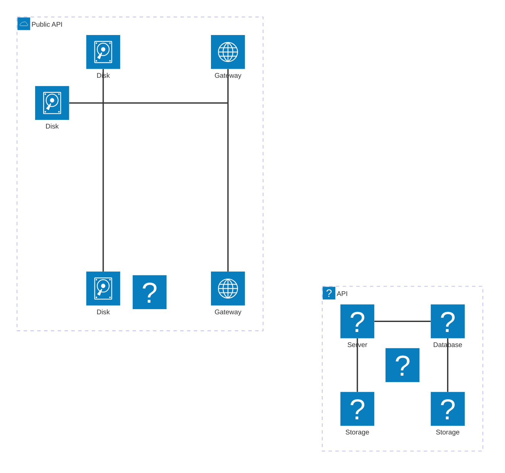

## Foo

```mermaid
architecture-beta
    group api(logos:aws-lambda)[API]

    service db(logos:aws-aurora)[Database] in api
    service disk1(logos:aws-glacier)[Storage] in api
    service disk2(logos:aws-s3)[Storage] in api
    service server(logos:aws-ec2)[Server] in api
    service fpp(logos:ai-platform-unified) in api
    service bar(logos:Arch_Elastic-Load-Balancing) in public_api
    db:L -- R:server
    disk1:T -- B:server
    disk2:T -- B:db

    group public_api(cloud)[Public API]

    service left_disk(disk)[Disk] in public_api
    service top_disk(disk)[Disk] in public_api
    service bottom_disk(disk)[Disk] in public_api
    service top_gateway(internet)[Gateway] in public_api
    service bottom_gateway(internet)[Gateway] in public_api
    junction junctionCenter
    junction junctionRight

    left_disk:R -- L:junctionCenter
    top_disk:B -- T:junctionCenter
    bottom_disk:T -- B:junctionCenter
    junctionCenter:R -- L:junctionRight
    top_gateway:B -- T:junctionRight
    bottom_gateway:T -- B:junctionRight

```