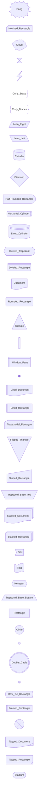

# Foo

```mermaid
flowchart LR
Bang@{ shape: bang }
    Bang@{ shape: bang }
    Notched_Rectangle@{ shape: notch-rect }
    Cloud@{ shape: cloud }
    Hourglass@{ shape: hourglass }
    Lightning_Bolt@{ shape: bolt }
    Curly_Brace@{ shape: brace }
    Curly_Brace@{ shape: brace-r }
    Curly_Braces@{ shape: braces }
    Lean_Right@{ shape: lean-r }
    Lean_Left@{ shape: lean-l }
    Cylinder@{ shape: cyl }
    Diamond@{ shape: diam }
    Half-Rounded_Rectangle@{ shape: delay }
    Horizontal_Cylinder@{ shape: h-cyl }
    Lined_Cylinder@{ shape: lin-cyl }
    Curved_Trapezoid@{ shape: curv-trap }
    Divided_Rectangle@{ shape: div-rect }
    Document@{ shape: doc }
    Rounded_Rectangle@{ shape: rounded }
    Triangle@{ shape: tri }
    Filled_Rectangle@{ shape: fork }
    Window_Pane@{ shape: win-pane }
    Filled_Circle@{ shape: f-circ }
    Lined_Document@{ shape: lin-doc }
    Lined_Rectangle@{ shape: lin-rect }
    Trapezoidal_Pentagon@{ shape: notch-pent }
    Flipped_Triangle@{ shape: flip-tri }
    Sloped_Rectangle@{ shape: sl-rect }
    Trapezoid_Base_Top@{ shape: trap-t }
    Stacked_Document@{ shape: docs }
    Stacked_Rectangle@{ shape: st-rect }
    Odd@{ shape: odd }
    Flag@{ shape: flag }
    Hexagon@{ shape: hex }
    Trapezoid_Base_Bottom@{ shape: trap-b }
    Rectangle@{ shape: rect }
    Circle@{ shape: circle }
    Small_Circle@{ shape: sm-circ }
    Double_Circle@{ shape: dbl-circ }
    Framed_Circle@{ shape: fr-circ }
    Bow_Tie_Rectangle@{ shape: bow-rect }
    Framed_Rectangle@{ shape: fr-rect }
    Crossed_Circle@{ shape: cross-circ }
    Tagged_Document@{ shape: tag-doc }
    Tagged_Rectangle@{ shape: tag-rect }
    Stadium@{ shape: stadium }

```
