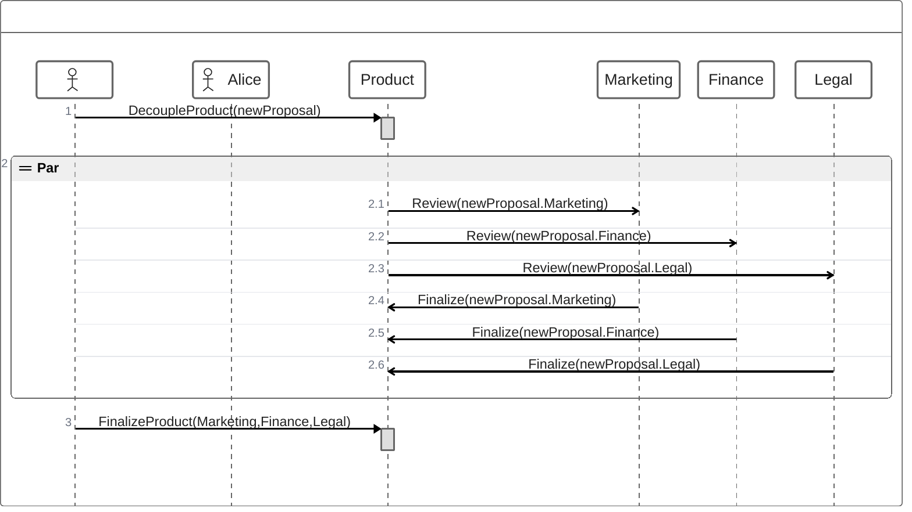

# ZenUML

```mermaid
zenuml
@Actor Alice
Product.DecoupleProduct(newProposal)

par{
  Product -> Marketing:Review(newProposal.Marketing)
  Product -> Finance:Review(newProposal.Finance)
  Product -> Legal:Review(newProposal.Legal)

  Marketing -> Product:Finalize(newProposal.Marketing)
  Finance -> Product:Finalize(newProposal.Finance)
  Legal -> Product:Finalize(newProposal.Legal)
}

Product.FinalizeProduct(Marketing, Finance, Legal)

```