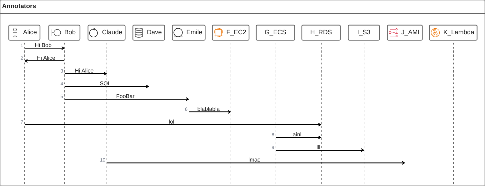

# Foo

```mermaid
zenuml
    title Annotators
    @Actor Alice
    @Boundary Bob
    @Control Claude
    @Database Dave
    @Entity Emile
    @EC2 F_EC2
    @ECS G_ECS
    @RDS H_RDS
    @S3 I_S3
    @IAM J_AMI
    @Lambda K_Lambda
    Alice->Bob: Hi Bob
    Bob->Alice: Hi Alice
    Bob->Claude: Hi Alice
    Bob->Dave: SQL
    Bob->Emile: FooBar
    Emile->F_EC2: blablabla
    Alice->H_RDS:lol
    G_ECS->H_RDS: ainl
    G_ECS->I_S3: lll
    Claude->J_AMI:lmao
```
