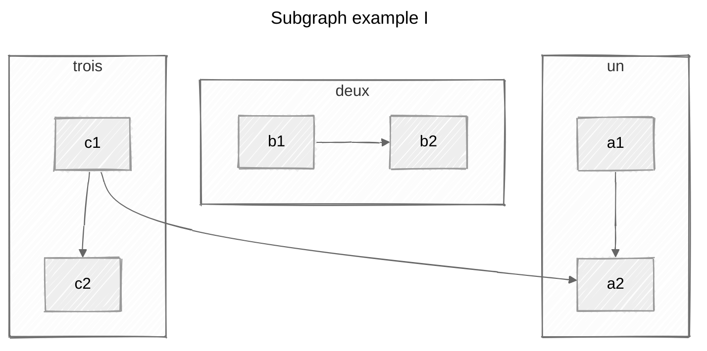
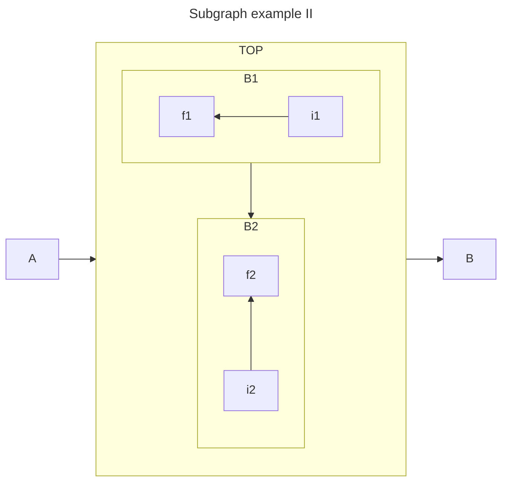

# FlowChart Sub graphs

```mermaid
---
title: Subgraph example I
config:
  look: handDrawn
  theme: neutral
---
flowchart TB
    c1-->a2
    subgraph un
    a1-->a2
    end
    subgraph deux
    b1-->b2
    end
    subgraph trois
    c1-->c2
    end

```

```mermaid
---
title: Subgraph example II
---
flowchart LR
  subgraph TOP
    direction TB
    subgraph B1
        direction RL
        i1 -->f1
    end
    subgraph B2
        direction BT
        i2 -->f2
    end
  end
  A --> TOP --> B
  B1 --> B2
```