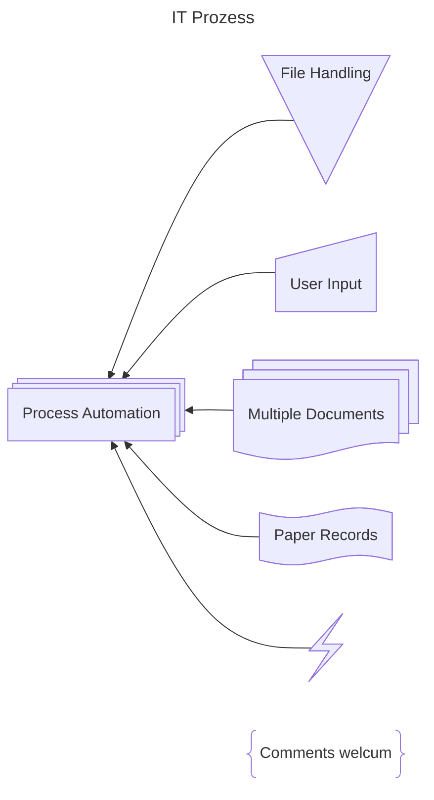

# Mermaid examples

## Matrix

### Organization <-> Product

||A|B|C|
|-|-|-|-|
|X|•|•||
|Y||•||
|Z|||•|

| | ico | shortcode | ico | shortcode | |
| - | :-: | - | :-: | - | - |
| [top](#smileys--emotion) | :grinning: | `:grinning:` | :smiley: | `:smiley:` | [top](#table-of-contents) |
| [top](#smileys--emotion) | :smile: | `:smile:` | :grin: | `:grin:` | [top](#table-of-contents) |
| [top](#smileys--emotion) | :laughing: | `:laughing:`   `:satisfied:` | :sweat_smile: | `:sweat_smile:` | [top](#table-of-contents) |
| [top](#smileys--emotion) | :rofl: | `:rofl:` | :joy: | `:joy:` | [top](#table-of-contents) |
| [top](#smileys--emotion) | :slightly_smiling_face: | `:slightly_smiling_face:` | :upside_down_face: | `:upside_down_face:` | [top](#table-of-contents) |
| [top](#smileys--emotion) | :melting_face: | `:melting_face:` | :wink: | `:wink:` | [top](#table-of-contents) |
| [top](#smileys--emotion) | :blush: | `:blush:` | :innocent: | `:innocent:` | [top](#table-of-contents) |