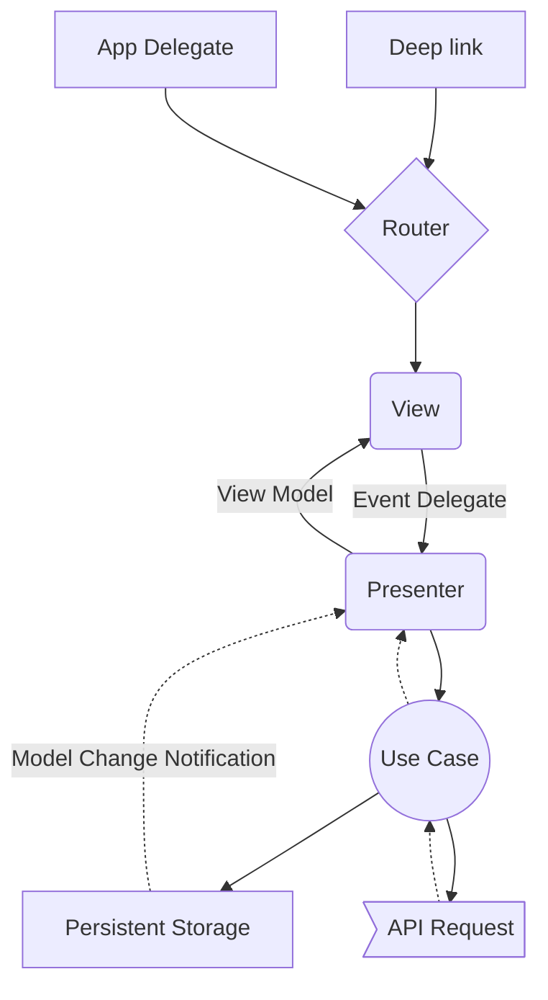

# Model-View-(Controller|Presenter)

```mermaid
graph TD
D[Deep link]-->R
A[App Delegate]-->R
R{Router} -->V(View)
P(Presenter) -- View Model --> V(View)
V -- Event Delegate --> P
P --> U1((Use Case))
U1-.->P
U1-->S[Persistent Storage]
S-. Model Change Notification .->P
U1-->A1>API Request]
A1-.->U1
```