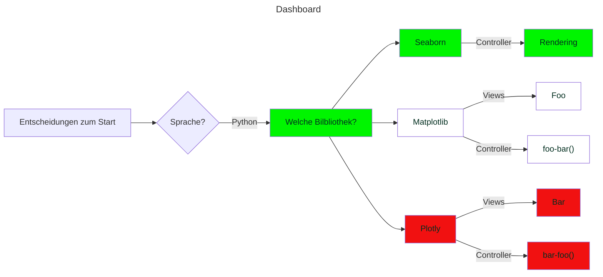

```mermaid
---
title: Dashboard
---
 flowchart LR;
      A[Entscheidungen zum Start]-->B{Sprache?};
      classDef green color:#022e1f,fill:#00f500;
      classDef red color:#022e1f,fill:#f11111;
      classDef white color:#022e1f,fill:#fff;
      classDef black color:#fff,fill:#000;
      B--Python-->C[Welche Bilbliothek?]:::green;  
      C-->U[Seaborn]:::green;
     
      
      U--Controller-->Views["Rendering"]:::green;
      
      C-->I[Matplotlib]:::white;
      I--Views-->O["Foo"]:::white;
      I--Controller-->P["foo-bar()"]:::white;
      
      C-->X[Plotly]:::red;
      X--Views-->V["Bar"]:::red;
      X--Controller-->N["bar-foo()"]:::red;
      
  
```