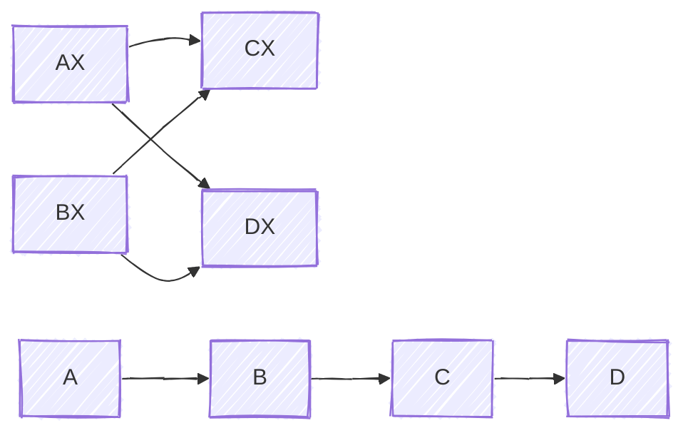

```mermaid
---
config:
    look: handDrawn
    
---
flowchart LR;
        AX & BX--> CX & DX
		A-->B;
		B-->C;
		C-->D;
		click A callback "Tooltip for a callback"
		click B "http://www.github.com/SchrodtSven" "This is a tooltip for a link"
		click A call callback() "Tooltip for a callback"
		click B href "http://www.github.com" "This is a tooltip for a link"
```