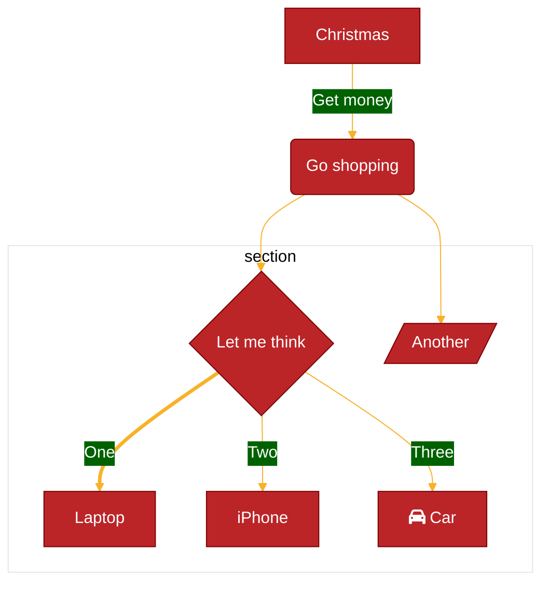
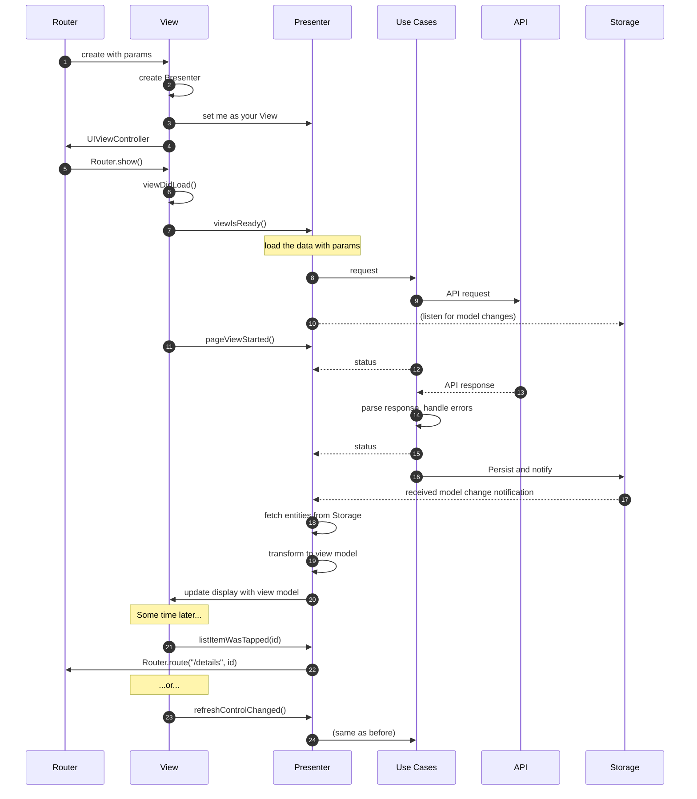
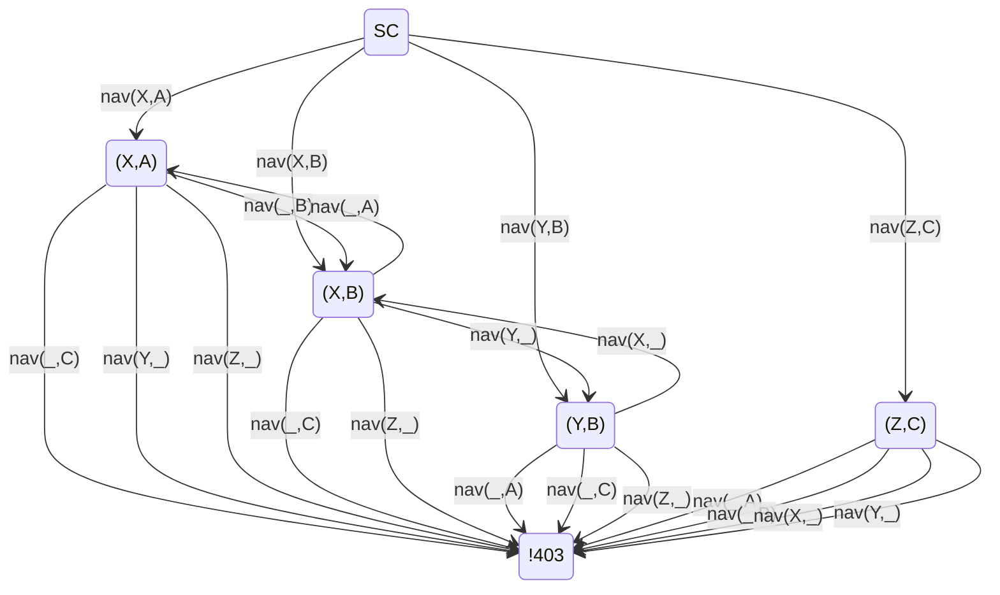

# FOOO

```mermaid
%%{
  init: {
    'theme': 'base',
    'themeVariables': {
      'primaryColor': '#BB2528',
      'primaryTextColor': '#fff',
      'primaryBorderColor': '#7C0000',
      'lineColor': '#F8B229',
      'secondaryColor': '#006100',
      'tertiaryColor': '#fff'
    }
  }
}%%
        graph TD
          A[Christmas] -->|Get money| B(Go shopping)
          B --> C{Let me think}
          B --> G[/Another/]
          C ==>|One| D[Laptop]
          C -->|Two| E[iPhone]
          C -->|Three| F[fa:fa-car Car]
          subgraph section
            C
            D
            E
            F
            G
          end

```

## Seq d

## Sequence Diagram

```mermaid
sequenceDiagram
  autonumber
	Router->>View: create with params
	View->>View: create Presenter
    View->>Presenter: set me as your View
    View->>Router: UIViewController
    Router->>View: Router.show()
    View->>View: viewDidLoad()
    View->>Presenter: viewIsReady()
    Note over Presenter: load the data with params
    Presenter->>Use Cases: request
    Use Cases->>API: API request
    Presenter-->>Storage: (listen for model changes)
    View->>Presenter: pageViewStarted()
    Use Cases-->>Presenter: status
    API-->>Use Cases: API response
    Use Cases->>Use Cases: parse response, handle errors
    Use Cases-->>Presenter: status
    Use Cases->>Storage: Persist and notify
    Storage-->>Presenter: received model change notification
    Presenter->>Presenter: fetch entities from Storage
    Presenter->>Presenter: transform to view model
    Presenter->>View: update display with view model
    Note over View: Some time later...
    View->>Presenter: listItemWasTapped(id)
    Presenter->>Router: Router.route("/details", id)
    Note over View: ...or...
    View->>Presenter: refreshControlChanged()
    Presenter->>Use Cases: (same as before) 
```

### klklk

```mermaid

stateDiagram-v2
  SC --> (X,A): nav(X,A)
  SC --> (X,B): nav(X,B)
  SC --> (Y,B): nav(Y,B)
  SC --> (Z,C): nav(Z,C)

  (X,A) --> (X,B): nav(_,B)
  (X,A) --> !403: nav(_,C)
  (X,A) --> !403: nav(Y,_)
  (X,A) --> !403: nav(Z,_)

  (X,B) --> (X,A): nav(_,A)
  (X,B) --> !403: nav(_,C)
  (X,B) --> (Y,B): nav(Y,_)
  (X,B) --> !403: nav(Z,_)

  (Y,B) --> !403: nav(_,A)
  (Y,B) --> !403: nav(_,C)
  (Y,B) --> (X,B): nav(X,_)
  (Y,B) --> !403: nav(Z,_)

  (Z,C) --> !403: nav(_,A)
  (Z,C) --> !403: nav(_,B)
  (Z,C) --> !403: nav(X,_)
  (Z,C) --> !403: nav(Y,_)


```