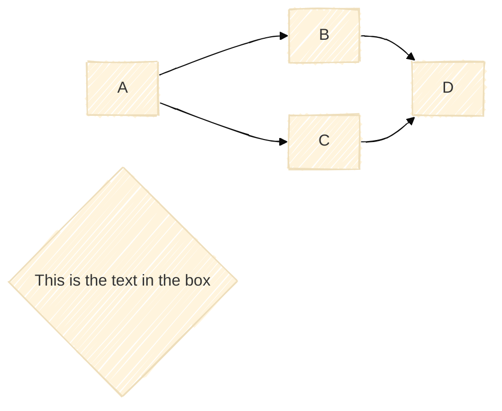
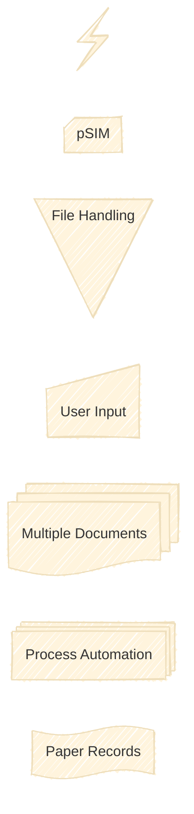

```mermaid
---
config:
    look: handDrawn
    theme: base
---
    graph LR
    A --> B
    A --> C
    B --> D
    C --> D
    id1{This is the text in the box}
```

```mermaid
---
config:
    look: handDrawn
    theme: base
---

flowchart RL
    Y@{ shape: bolt, label: "Communication link" }
    Z@{ shape: notch-rect, label: "pSIM" }
    A@{ shape: manual-file, label: "File Handling"}
    B@{ shape: manual-input, label: "User Input"}
    C@{ shape: docs, label: "Multiple Documents"}
    D@{ shape: procs, label: "Process Automation"}
    E@{ shape: paper-tape, label: "Paper Records"}
```