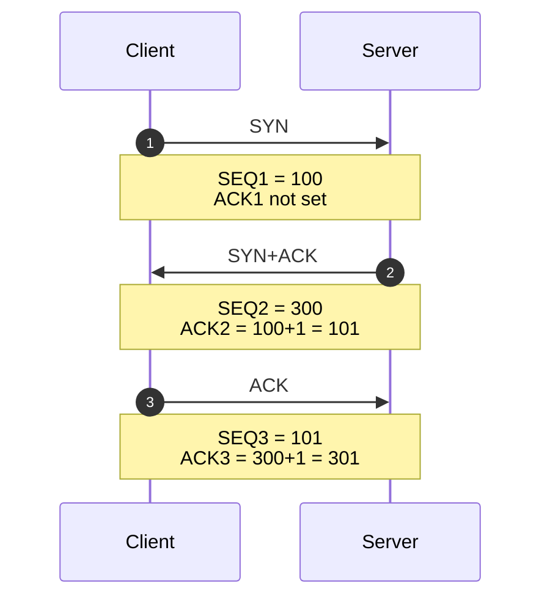

# Transmisson Control Protocol

## Three-way Handshake (Sequence Diagram)

```mermaid
sequenceDiagram
autonumber
  participant c as Client
  participant s as Server
  
  c->>s: SYN
  note over c, s: SEQ1 = 100<br>ACK1 not set
  s->>c: SYN+ACK
  note over c, s: SEQ2 = 300<br>ACK2 = 100+1 = 101
  c->>s: ACK
  note over c, s: SEQ3 = 101<br>ACK3 = 300+1 = 301


```