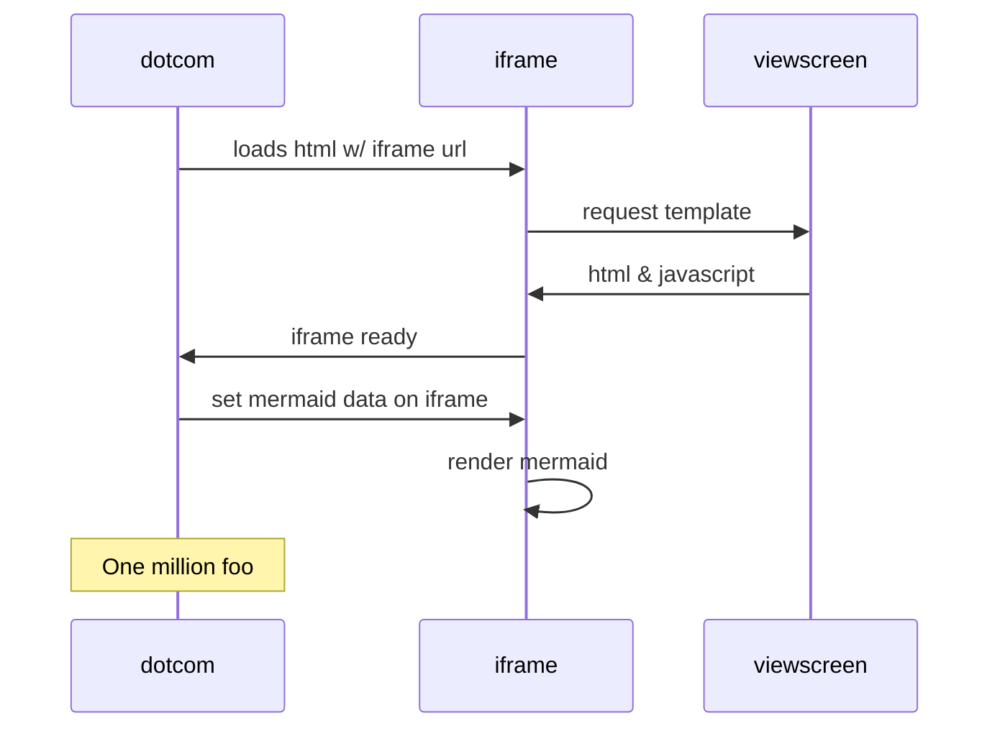

# Mermaid

# How mermaid is generated by Github


## Code 4 colorizing

```
%%{init:{'theme':'forest'}}%%
%%{init:{'themeCSS':'.messageLine0:nth-of-type(2) { stroke: red; };.messageText:nth-of-type(1) { fill: green; font-size: 30px !important;}; g:nth-of-type(3) rect.actor { stroke:blue;fill: pink; }; g:nth-of-type(5) .note { stroke:blue;fill: crimson; };#arrowhead path {stroke: blue; fill:red;};'}}%%

```